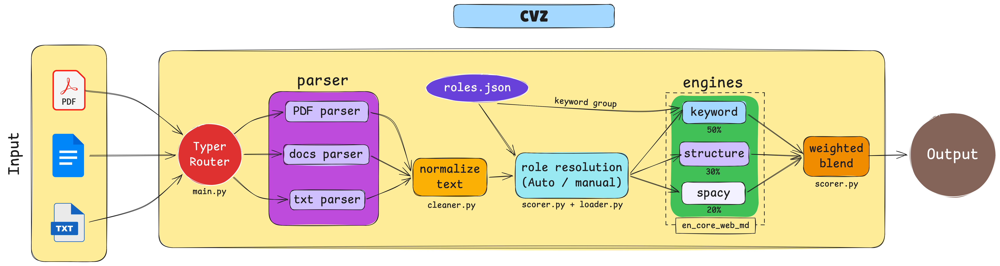

<div align="center">

# ⚡ cvz — ATS Resume Analyzer

**Stop guessing. Start scoring.**

A blazing-fast CLI tool that tells you _exactly_ how well your resume matches a job — before a recruiter's ATS does.

[](https://pypi.org/project/cvz/)
[](https://pypi.org/project/cvz/)
[](LICENSE)

**[🌐 Live Demo](https://cvz-cli.vercel.app/) · [📦 PyPI](https://pypi.org/project/cvz/) · [🐛 Report Bug](https://github.com/)**

</div>

---



---

## Why cvz?

Most resumes get rejected before a human ever reads them — filtered out by ATS (Applicant Tracking Systems) that scan for keywords and structure. `cvz` puts that power in your hands:

- 🔍 **Keyword matching** — see exactly which role keywords you're hitting (and missing)
- 🧠 **Semantic similarity** — goes beyond exact matches using NLP
- 🏗️ **Structure scoring** — checks for the sections recruiters expect
- 🚀 **Works instantly** — no cloud, no signup, no waiting

---

## Installation

```bash
pip install cvz
```

Or build from source:

```bash
git clone <repo>
cd cvscan
pip install -e .
```

> Requires Python 3.9+

For better semantic scoring, grab the spaCy model:

```bash
python -m spacy download en_core_web_md
```

> Without it? No problem — `cvz` gracefully skips semantic scoring and keeps everything else running.

---

## Quick Start

```bash
# Analyze against a specific role
cvz analyze resume.pdf --role backend

# Let cvz figure out the best role for you
cvz analyze resume.pdf

# Analyze against a raw job description
cvz analyze resume.pdf --jd "python django rest api postgresql"
```

---

## Commands

### `analyze` — Score your resume

```bash
cvz analyze resume.pdf --role backend
cvz analyze resume.pdf --role devops --export report.json
```

### `suggest-role` — Find your best-fit roles

Not sure which roles to target? cvz will tell you.

```bash
cvz suggest-role resume.pdf
cvz suggest-role resume.pdf --top 10
```

### `gap` — Discover what's missing

See your strengths and the skills you need to add.

```bash
cvz gap resume.pdf --role machine_learning
cvz gap resume.pdf --role backend --export gap.json
```

### `compare` — Rank multiple resume versions

```bash
cvz compare r1.pdf r2.pdf r3.pdf
cvz compare r1.pdf r2.pdf --role frontend --export compare.json
```

### `roles` — Browse supported roles

```bash
cvz roles
```

### `--version`

```bash
cvz --version
```

---

## How Scoring Works

Each resume is evaluated across three dimensions:

| Metric       | Weight | What it checks                                  |
| ------------ | ------ | ----------------------------------------------- |
| 🔑 Keyword   | 50%    | Core (70%) + secondary (30%) role keywords      |
| 🧠 Semantic  | 30%    | spaCy cosine similarity against role vocabulary |
| 🏗️ Structure | 20%    | Standard sections present + appropriate length  |

**Score thresholds:**

| Score  | Rating          |
| ------ | --------------- |
| ≥ 75%  | ✅ Great match  |
| 50–74% | 🟡 Decent match |
| < 50%  | 🔴 Low match    |

---

## Supported Roles

|                    |                     |
| ------------------ | ------------------- |
| `backend`          | `frontend`          |
| `full_stack`       | `software_engineer` |
| `data_scientist`   | `data_analyst`      |
| `machine_learning` | `ai_engineer`       |
| `devops`           | `cloud_engineer`    |
| `android`          | `ios`               |
| `cybersecurity`    | `qa_engineer`       |
| `product_manager`  | `ui_ux_designer`    |
| `blockchain`       | `embedded_systems`  |

Run `cvz roles` for the full list. Role keyword sets live in `src/cvscan/data/roles.json` — fully extensible.

---

## Supported File Formats

| Format  | Parser                           |
| ------- | -------------------------------- |
| `.pdf`  | `pdfplumber`                     |
| `.docx` | `python-docx` (including tables) |
| `.txt`  | built-in                         |

---

## Project Structure

```
cvscan/
├── src/
│   └── cvscan/
│       ├── main.py                 # CLI entry (Typer)
│       ├── data/
│       │   └── roles.json          # Role keyword definitions
│       ├── engines/
│       │   ├── keyword_engine.py   # Keyword scoring
│       │   ├── spacy_engine.py     # Semantic similarity
│       │   └── structure_engine.py # Resume structure
│       ├── parser/
│       │   ├── pdf_parser.py       # PDF extraction
│       │   └── docx_parser.py      # DOCX extraction + tables
│       └── utils/
│           ├── loader.py           # File + role loading
│           ├── cleaner.py          # Text normalisation
│           └── scorer.py           # Shared scoring logic
├── pyproject.toml
└── requirements.txt
```

---

## Dependencies

```
typer · rich · pdfplumber · python-docx · spacy · scikit-learn
```

---

## Author

Built by **Anik Chand**

---

<div align="center">

If `cvz` helped you land an interview, consider leaving a ⭐

</div>
